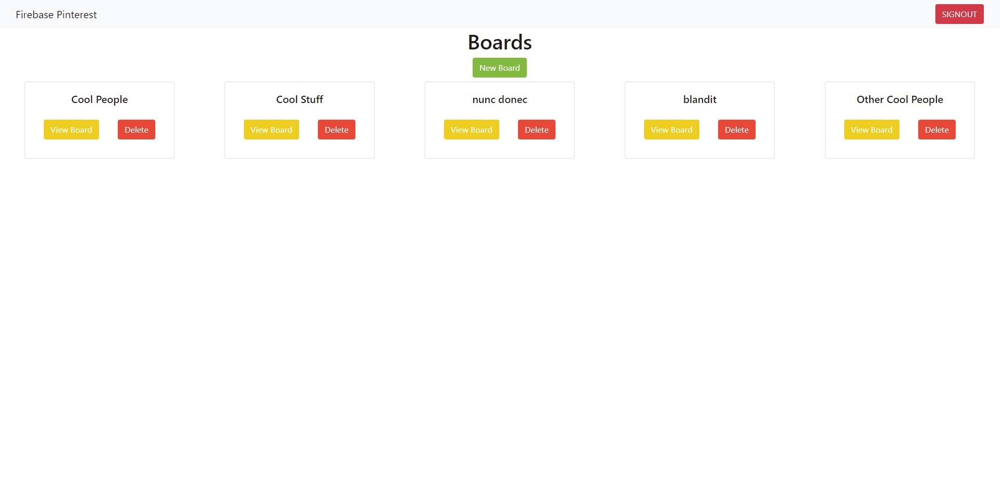
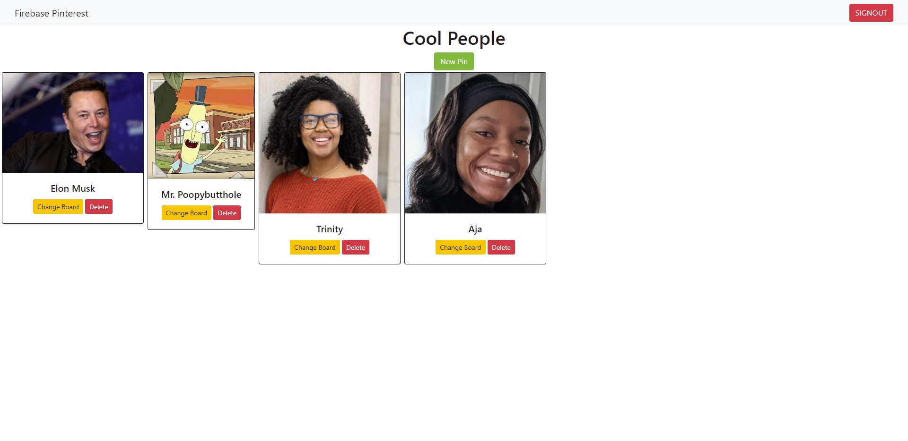

[![Contributors][contributors-shield]][contributors-url]
[![Forks][forks-shield]][forks-url]
[![Stargazers][stars-shield]][stars-url]
[![Issues][issues-shield]][issues-url]
[![LinkedIn][linkedin-shield]][linkedin-url]

<!-- PROJECT LOGO -->
 

  <h3 align="center">Firebase Pinterest</h3>

  

    Firebase Pinterest is an application for storing sets (boards) of images (pins).
     
     
    <a href="https://hj-firebase-pinterest.netlify.app/">View Deployed Site</a>
    ·
    <a href="https://github.com/HunterJuneau/ASSIGNMENT-Firebase-Pinterest/issues">Report Bug</a>
    ·
    <a href="https://github.com/HunterJuneau/ASSIGNMENT-Firebase-Pinterest/issues">Request Feature</a>
  

<!-- TABLE OF CONTENTS -->

  
<h2 style="display: inline-block">Table of Contents</h2>

  <ol>
    <li>
      <a href="#about-the-project">About The Project</a>
      <ul>
        <li><a href="#built-with">Built With</a></li>
      </ul>
    </li>
    <li><a href="#roadmap">Roadmap</a></li>
    <li><a href="#contact">Contact</a></li>
  </ol>

<!-- ABOUT THE PROJECT -->
## About The Project

### Boards View

### Pins View

### Built With

* [Webpack](https://webpack.js.org/)
* [Firebase](https://firebase.google.com/)
* [Bootstrap](https://getbootstrap.com/)
* [JQuery](https://jquery.com/)
* [Sass](https://sass-lang.com/)

<!-- ROADMAP -->
## Roadmap

See the [open issues](https://github.com/HunterJuneau/ASSIGNMENT-Firebase-Pinterest/issues) for a list of proposed features (and known issues).

<!-- CONTACT -->
## Contact

Your Name - [@huntlee17](https://twitter.com/huntlee17) - huntlee17@gmail.com

Project Link: [https://github.com/HunterJuneau/ASSIGNMENT-Firebase-Pinterest](https://github.com/HunterJuneau/ASSIGNMENT-Firebase-Pinterest)

<!-- MARKDOWN LINKS & IMAGES -->
[contributors-shield]: https://img.shields.io/github/contributors/HunterJuneau/repo.svg?style=for-the-badge
[contributors-url]: https://github.com/HunterJuneau/repo/graphs/contributors
[forks-shield]: https://img.shields.io/github/forks/HunterJuneau/repo.svg?style=for-the-badge
[forks-url]: https://github.com/HunterJuneau/repo/network/members
[stars-shield]: https://img.shields.io/github/stars/HunterJuneau/repo.svg?style=for-the-badge
[stars-url]: https://github.com/HunterJuneau/repo/stargazers
[issues-shield]: https://img.shields.io/github/issues/HunterJuneau/repo.svg?style=for-the-badge
[issues-url]: https://github.com/HunterJuneau/repo/issues
[linkedin-shield]: https://img.shields.io/badge/-LinkedIn-black.svg?style=for-the-badge&logo=linkedin&colorB=555
[linkedin-url]: https://linkedin.com/in/HunterJuneau
